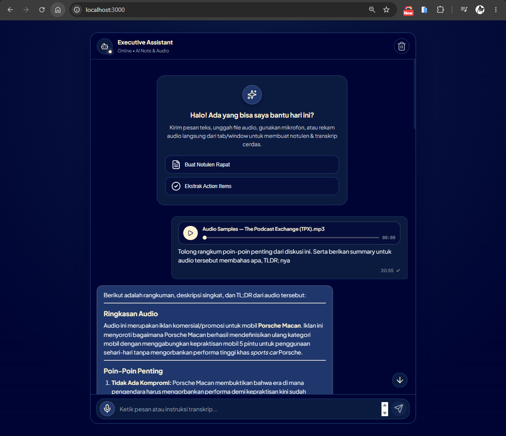
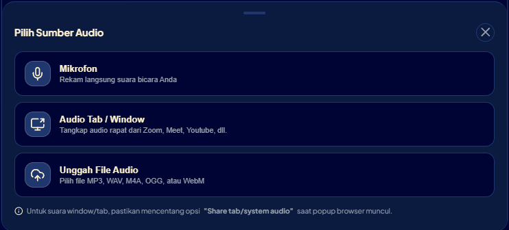

# 🎙️ Executive AI Assistant & Notulen Chatbot

> Asisten AI cerdas berbasis **Google Gemini (gemini-3.6-flash)** dengan spesialisasi notulen rapat eksekutif, transkripsi audio multi-sumber, serta antarmuka modern berpendekatan **Mobile-First**.

---

## 📸 Tampilan Antarmuka (Interface Preview)

Berikut adalah pratinjau antarmuka pengguna (*user interface*) yang telah dioptimalkan untuk perangkat mobile dan desktop dengan palet warna kontras tinggi:

| 📱 Mobile-First Overview | 💬 Chat & Audio Feature |
| :---: | :---: |
|  |  |
| *Tampilan Beranda, Input Bar, & Kartu Rekomendasi Notulen* | *Alur Percakapan, Pemutar Audio, & Notulen AI* |

---

## ✨ Fitur Utama

- **🧠 Notulen Rapat Eksekutif & General Chat**:
  - Format terstruktur mencakup Ringkasan Eksekutif, Keputusan Utama, dan *Action Items*.
  - Riwayat obrolan kontekstual multi-turn melalui endpoint `/api/query`.
  - Rendering Markdown interaktif (tabel, daftar ceklis, teks tebal, blok kode).

- **🎧 Kemampuan Pemrosesan Audio Lengkap**:
  - **Unggah File Audio**: Mendukung format `.mp3`, `.wav`, `.ogg`, `.m4a`, `.webm`, dan `.flac`.
  - **Rekaman Mikrofon**: Rekam audio langsung secara *real-time* dengan visualizer gelombang suara dan timer aktif.
  - **Rekam Audio Tab / Window (System/Meeting Audio)**: Tangkap suara langsung dari aplikasi rapat (Zoom, Google Meet, Microsoft Teams, YouTube) via browser `getDisplayMedia`.
  - **In-Chat Audio Player**: Setiap audio yang dikirim dapat langsung diputar ulang dengan kontrol *seek* dan waktu.

- **🎨 Desain Profesional & Visual Depth**:
  - **Mobile-First Design**: Disesuaikan untuk interaksi layar sentuh, *safe-area inset* ponsel, dan tombol mudah dijangkau satu tangan.
  - **Palet Warna Terkurasi (Color Hunt)**:
    - `#010736` &mdash; *Dark Navy* (Latar Belakang Canvas & Header).
    - `#0D1C42` &mdash; *Deep Blue* (Bubble Chat User, Container Input, Kartu Notulen).
    - `#22396F` &mdash; *Slate Blue* (Bubble Chat AI, Elemen Interaktif, Garis Pembatas).
    - `#FCF1D0` &mdash; *Cream / Gold Accent* (Ikon Aktif, Judul Aksen, Tombol Kirim & Aksi).
  - Standar aksesibilitas tinggi (**WCAG AAA**) dengan teks narasi putih lembut `#F3F4F6`.

---

## 🛠️ Prasyarat Sistem

Sebelum menjalankan aplikasi, pastikan sistem Anda telah terpasang:
- **Node.js** versi `18.0.0` atau yang lebih baru.
- **npm** atau **pnpm** package manager.
- **Google Gemini API Key** (dapatkan di [Google AI Studio](https://aistudio.google.com/)).

---

## 🚀 Panduan Instalasi & Penggunaan

### 1. Masuk ke Direktori Proyek
Buka terminal (PowerShell / Command Prompt / Terminal) dan arahkan ke direktori proyek:
```bash
cd R:\IMAM\Project\hacktiv8\simple-chatbot
```

### 2. Instal Dependensi
Jalankan perintah berikut untuk memastikan seluruh pustaka terpasang:
```bash
npm install
# atau jika menggunakan pnpm:
pnpm install
```

### 3. Konfigurasi File Environment (`.env`)
Buat atau pastikan file `.env` berada di root proyek dengan konfigurasi:
```env
GEMINI_API_KEY=your_actual_gemini_api_key_here
```

### 4. Menjalankan Server
Mulai server Node.js:
```bash
node index.js
```
Jika berhasil, terminal akan menampilkan:
```
Server up on http://localhost:3000
```

### 5. Akses Aplikasi di Browser
Buka browser favorit Anda dan kunjungi:
👉 **[http://localhost:3000](http://localhost:3000)**

> 💡 **Tips Pengujian Mode Mobile**:
> Buka Developer Tools di browser (`F12` atau `Ctrl+Shift+I`), lalu tekan `Ctrl+Shift+M` (*Toggle Device Toolbar*) untuk mensimulasikan layar smartphone (misal iPhone, Samsung Galaxy, atau Pixel).

---

## 🎙️ Panduan Fitur Rekaman Audio

1. Klik tombol **Mikrofon** (berwarna emas) di samping kolom input untuk membuka menu pemilihan sumber audio:
   - **Mikrofon**: Untuk merekam suara Anda langsung melalui mic perangkat.
   - **Audio Tab / Window**: Untuk merekam suara presentasi/rapat daring (Zoom, Google Meet, YouTube).
     > ⚠️ **PENTING**: Saat popup izin browser muncul, pilih tab atau window yang diinginkan dan **pastikan mencentang opsi "Share audio" / "Bagikan audio"** di pojok kiri bawah dialog browser.
   - **Unggah File Audio**: Untuk memilih file rekaman yang sudah tersimpan di komputer/ponsel.
2. Anda dapat menambahkan catatan/instruksi khusus di kolom input (contoh: *"Fokus pada keputusan anggaran"*).
3. Klik tombol **Kirim** untuk memproses audio ke Gemini AI.

---

## 📁 Struktur Direktori

```plaintext
simple-chatbot/
├── assets/                  # Aset gambar pratinjau antarmuka
│   ├── interface-1.png
│   └── interface-2.png
├── public/                  # Berkas Frontend (Static Client)
│   ├── index.html           # Struktur antarmuka semantik & modal
│   ├── style.css            # Styling Mobile-First & token warna
│   └── app.js               # Logika chat, perekam audio, & Web API
├── .env                     # Variabel konfigurasi lingkungan & API Key
├── index.js                 # Server Express.js & integrasi Gemini API
├── package.json             # Manifest dependensi proyek
├── README.md                # Dokumentasi panduan proyek
└── CHANGELOG.md             # Riwayat versi dan perubahan fitur
```

---

## 🔌 Rincian API Endpoint

| Endpoint | Method | Payload / Form-Data | Deskripsi |
| :--- | :---: | :--- | :--- |
| `/api/query` | `POST` | `JSON: { conversation: [...] }` | Percakapan multi-turn terstruktur dengan prompt Notulen Eksekutif. |
| `/generate-from-audio` | `POST` | `FormData: audio (file), prompt (opsional)` | Transkripsi dan ekstraksi kesimpulan dari file/rekaman audio. |
| `/generate-text` | `POST` | `JSON: { prompt: "..." }` | Endpoint prompt teks satu arah (*single-turn*). |
| `/generate-from-image` | `POST` | `FormData: image (file), prompt (text)` | Pemrosesan multimodal berbasis gambar. |
| `/generate-from-doc` | `POST` | `FormData: document (file), prompt (text)` | Peringkasan dokumen berbasis file. |

---

## 🛡️ Lisensi & Kredit

Dikembangkan untuk prototype Hacktiv8 Sesi 2.
Lisensi: **ISC**.

